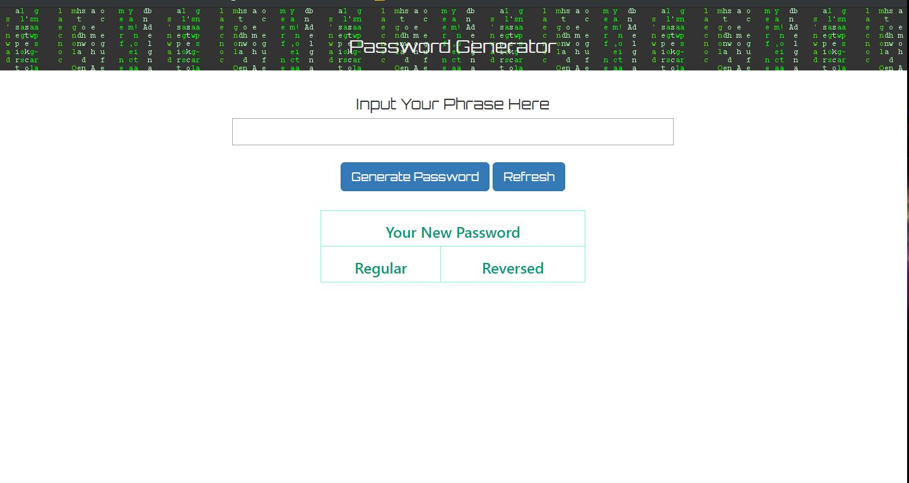

# Non Random Password Generator

## Overview
This app is to design a password generator with user's easy-to-remember phrase. It is not randomly generating string. It splits string into single character array, then go trhough character conversion function, return with different character, re-assemble into string.

## Technologies
* Math.floor
* Math.random
* Switch Case
* .after() to table

## Project Link

https://wenhaowu27.github.io/password_generator/

